# GitHub Actions Runner Controller (ARC) in AKS - Team Guide

## Overview

GitHub Actions Runner Controller (ARC) enables you to run GitHub Actions workflows on your own Kubernetes infrastructure (AKS) with auto-scaling capabilities. This guide covers architecture, setup, and best practices.

## Architecture Diagram

```mermaid
graph TB
    subgraph "GitHub"
        GH_REPO["GitHub Repository<br/>with Workflow"]
        GH_API["GitHub API"]
    end
    
    subgraph "Azure Kubernetes Service (AKS)"
        subgraph "arc-systems namespace"
            ARC_CONTROLLER["ARC Controller<br/>gha-runner-scale-set-controller"]
            LISTENER["Listener Pod<br/>arc-runner-set-listener"]
        end
        
        subgraph "arc-runners namespace"
            SCALE_SET["Runner Scale Set<br/>arc-runner-set"]
            RUNNER_POD1["Runner Pod 1<br/>arc-runner-set-xxx-runner-yyy"]
            RUNNER_POD2["Runner Pod 2<br/>(created on demand)"]
            RUNNER_POD3["Runner Pod N<br/>(scales as needed)"]
        end
        
        subgraph "Configuration"
            HELM_CHART["Helm Charts<br/>• gha-runner-scale-set-controller<br/>• gha-runner-scale-set"]
            CONFIG_SECRET["GitHub Config Secret<br/>• PAT Token<br/>• GitHub URL"]
        end
    end
    
    subgraph "Authentication"
        PAT["Personal Access Token<br/>(GitHub Classic PAT)"]
    end
    
    %% Workflow trigger and execution flow
    GH_REPO -->|"1. Workflow triggered<br/>runs-on: arc-runner-set"| GH_API
    GH_API -->|"2. Webhook notification"| LISTENER
    LISTENER -->|"3. Request runner creation"| ARC_CONTROLLER
    ARC_CONTROLLER -->|"4. Create/scale runner pods"| SCALE_SET
    SCALE_SET -->|"5. Provision runners"| RUNNER_POD1
    SCALE_SET -->|"5. Provision runners"| RUNNER_POD2
    SCALE_SET -->|"5. Provision runners"| RUNNER_POD3
    
    %% Runner execution flow
    RUNNER_POD1 -->|"6. Pull job"| GH_API
    RUNNER_POD2 -->|"6. Pull job"| GH_API
    RUNNER_POD3 -->|"6. Pull job"| GH_API
    GH_API -->|"7. Job results"| GH_REPO
    
    %% Configuration and authentication
    PAT -.->|"Authentication"| CONFIG_SECRET
    CONFIG_SECRET -.->|"GitHub API Access"| ARC_CONTROLLER
    HELM_CHART -.->|"Deploy"| ARC_CONTROLLER
    HELM_CHART -.->|"Deploy"| SCALE_SET
    
    %% Cleanup
    RUNNER_POD1 -.->|"8. Ephemeral - terminated after job"| SCALE_SET
    RUNNER_POD2 -.->|"8. Ephemeral - terminated after job"| SCALE_SET
    RUNNER_POD3 -.->|"8. Ephemeral - terminated after job"| SCALE_SET
```



## Key Components

### 1. **GitHub Layer**
- **Repository**: Contains workflows that trigger on various events
- **GitHub API**: Manages runner registration, job distribution, and status reporting

### 2. **AKS Cluster Components**
- **arc-systems namespace**: Contains management components
  - **ARC Controller**: Manages runner lifecycle and scaling
  - **Listener Pod**: Monitors GitHub for workflow events
- **arc-runners namespace**: Contains actual runner pods (security best practice)
  - **Runner Scale Set**: Manages pool of available runners
  - **Runner Pods**: Ephemeral pods that execute workflow jobs

### 3. **Configuration & Security**
- **Helm Charts**: Deploy and configure ARC components
- **GitHub Secrets**: Store PAT and configuration securely
- **PAT Token**: Authenticates ARC with GitHub API

## Why GitHub Personal Access Token (PAT) is Required

### Core Functions
1. **API Authentication**: ARC needs to authenticate with GitHub's API
2. **Runner Registration**: Register new runner instances with GitHub
3. **Job Polling**: Monitor for new workflow jobs
4. **Status Reporting**: Report runner availability and job results
5. **Lifecycle Management**: Handle runner creation/destruction

### Required PAT Permissions

#### Repository-level Runners:
- `repo` (full repository access)
- `workflow` (update GitHub Action workflows)

#### Organization-level Runners:
- `admin:org` (full control of orgs and teams)
- `repo` (full repository access)

#### Enterprise-level Runners:
- `admin:enterprise` (full control of enterprises)
- `repo` (full repository access)

### Security Flow


## Prerequisites

- **Kubernetes Cluster**: AKS cluster with API server access
- **Helm 3**: Package manager for Kubernetes
- **GitHub PAT**: Classic Personal Access Token with required permissions
- **kubectl**: Kubernetes command-line tool configured for your cluster

**Note**: OpenShift clusters are currently unsupported.

## Installation Steps

### Step 1: Install ARC Controller

```bash
# Set namespace for controller components
NAMESPACE="arc-systems"

# Install ARC controller using Helm
helm install arc \
    --namespace "${NAMESPACE}" \
    --create-namespace \
    oci://ghcr.io/actions/actions-runner-controller-charts/gha-runner-scale-set-controller
```

### Step 2: Generate GitHub PAT

1. Go to GitHub → Settings → Developer settings → Personal access tokens
2. Generate new token (classic) with required permissions
3. Store token securely

### Step 3: Configure Runner Scale Set

```bash
# Configuration variables
INSTALLATION_NAME="arc-runner-set"
NAMESPACE="arc-runners"
GITHUB_CONFIG_URL="https://github.com/<your_enterprise/org/repo>"
GITHUB_PAT="<YOUR_PAT_TOKEN>"

# Install runner scale set
helm install "${INSTALLATION_NAME}" \
    --namespace "${NAMESPACE}" \
    --create-namespace \
    --set githubConfigUrl="${GITHUB_CONFIG_URL}" \
    --set githubConfigSecret.github_token="${GITHUB_PAT}" \
    oci://ghcr.io/actions/actions-runner-controller-charts/gha-runner-scale-set
```

### Step 4: Verify Installation

```bash
# Check Helm installations
helm list -A

# Check controller pods
kubectl get pods -n arc-systems

# Check runner namespace
kubectl get pods -n arc-runners
```

Expected output:
```bash
NAME            NAMESPACE       REVISION        STATUS          CHART                                       
arc             arc-systems     1               deployed        gha-runner-scale-set-controller-0.4.0       
arc-runner-set  arc-runners     1               deployed        gha-runner-scale-set-0.4.0                  
```

## Usage in Workflows

Create a workflow that uses your ARC runners:

```yaml
name: Actions Runner Controller Demo
on:
  workflow_dispatch:

jobs:
  Explore-GitHub-Actions:
    # Use the INSTALLATION_NAME from your setup
    runs-on: arc-runner-set
    steps:
    - run: echo "🎉 This job uses runner scale set runners!"
    - name: Check runner details
      run: |
        echo "Runner name: $RUNNER_NAME"
        echo "Runner OS: $RUNNER_OS"
        kubectl version --client
```

## Security Best Practices

### 1. **Namespace Separation**
- Deploy controller and runners in separate namespaces
- Implement proper RBAC policies

### 2. **Secret Management**
```bash
# Create secret instead of passing PAT in CLI
kubectl create secret generic github-secret \
  --from-literal=github_token="${GITHUB_PAT}" \
  --namespace arc-runners

# Reference secret in Helm
helm install "${INSTALLATION_NAME}" \
    --namespace "${NAMESPACE}" \
    --create-namespace \
    --set githubConfigUrl="${GITHUB_CONFIG_URL}" \
    --set githubConfigSecret.github_token_secret_name="github-secret" \
    oci://ghcr.io/actions/actions-runner-controller-charts/gha-runner-scale-set
```

### 3. **Alternative: GitHub App (Production Recommended)**
```bash
# Use GitHub App instead of PAT
--set githubConfigSecret.github_app_id="${GITHUB_APP_ID}"
--set githubConfigSecret.github_app_installation_id="${GITHUB_APP_INSTALLATION_ID}"
--set githubConfigSecret.github_app_private_key="${GITHUB_APP_PRIVATE_KEY}"
```

### 4. **Monitoring and Logging**
- Implement log collection for controller, listeners, and runners
- Monitor runner utilization and scaling patterns
- Set up alerts for failed deployments or authentication issues

## Workflow Execution Flow

1. **Trigger**: Workflow triggered in GitHub repository
2. **Notification**: GitHub API sends webhook to listener pod
3. **Scale Decision**: ARC controller decides if new runners needed
4. **Pod Creation**: Kubernetes creates runner pods in arc-runners namespace
5. **Job Assignment**: GitHub assigns workflow jobs to available runners
6. **Execution**: Runner pods execute workflow steps
7. **Cleanup**: Ephemeral runner pods are terminated after job completion
8. **Scaling**: ARC scales down unnecessary runners

## Troubleshooting

### Common Issues

1. **Authentication Failures**
   - Verify PAT permissions and expiration
   - Check GitHub API rate limits
   - Validate `githubConfigUrl` format

2. **Pod Creation Issues**
   - Check namespace permissions
   - Verify cluster resources (CPU, memory)
   - Review ARC controller logs

3. **Workflow Not Triggering**
   - Confirm `runs-on` matches `INSTALLATION_NAME`
   - Check listener pod status
   - Verify webhook connectivity

### Debugging Commands

```bash
# Check controller logs
kubectl logs -n arc-systems deployment/arc-gha-runner-scale-set-controller

# Check listener logs
kubectl logs -n arc-runners -l app.kubernetes.io/name=gha-runner-scale-set-listener

# Check runner pod logs
kubectl logs -n arc-runners <runner-pod-name>

# View events
kubectl get events -n arc-runners --sort-by='.lastTimestamp'
```

## Scaling Configuration

### Basic Scaling Options
```yaml
# values.yaml for runner scale set
spec:
  minReplicas: 0
  maxReplicas: 10
  
  # Scale based on pending jobs
  scaleDownDelaySecondsAfterScaleOut: 300
  scaleDownFactor: 0.5
```

### Advanced Configuration
```yaml
# Resource limits per runner
resources:
  limits:
    cpu: "2"
    memory: "4Gi"
  requests:
    cpu: "1"
    memory: "2Gi"

# Node selector for specific node pools
nodeSelector:
  agentpool: github-runners
```

## Benefits of ARC

- ✅ **Cost Effective**: Pay only for compute when jobs run
- ✅ **Auto Scaling**: Automatic scaling based on workflow demand
- ✅ **Security**: Runners in your own infrastructure
- ✅ **Customization**: Full control over runner environment
- ✅ **Integration**: Native Kubernetes integration
- ✅ **Ephemeral**: Fresh, clean environment for each job

## Next Steps

1. **Production Setup**: Implement GitHub App authentication
2. **Resource Optimization**: Configure appropriate resource limits
3. **Monitoring**: Set up comprehensive logging and monitoring
4. **Networking**: Configure private networking if required
5. **Compliance**: Implement security policies and compliance measures

## References

- [GitHub ARC Quickstart Guide](https://docs.github.com/en/actions/tutorials/use-actions-runner-controller/quickstart)
- [ARC Authentication Documentation](https://docs.github.com/en/actions/tutorials/use-actions-runner-controller/authenticate-arc-to-github-api)
- [Helm Chart Configuration](https://github.com/actions/actions-runner-controller/tree/master/charts)
- [ARC Troubleshooting Guide](https://docs.github.com/en/actions/tutorials/use-actions-runner-controller/troubleshoot)

---

**Document Version**: 1.0  
**Last Updated**: January 2025  
**Prepared for**: Development Team 
