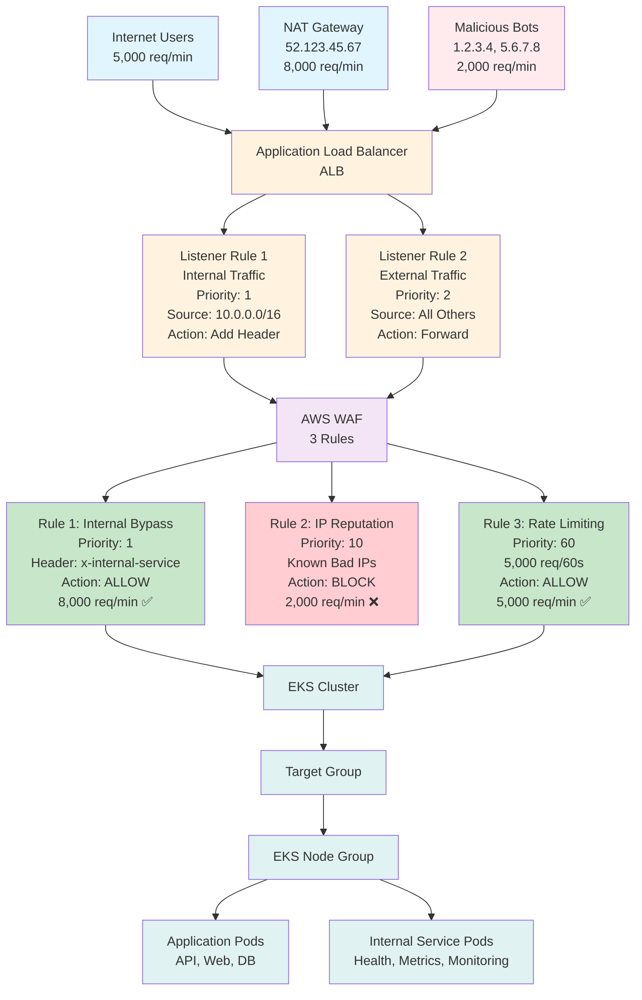
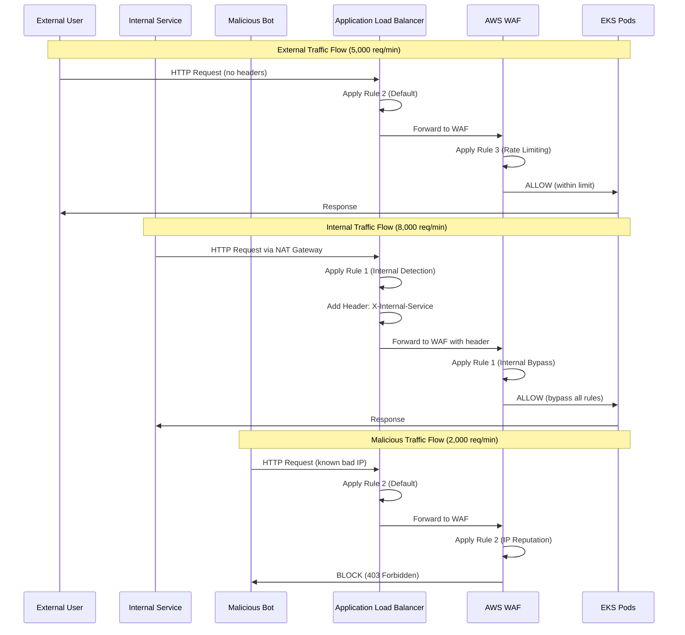
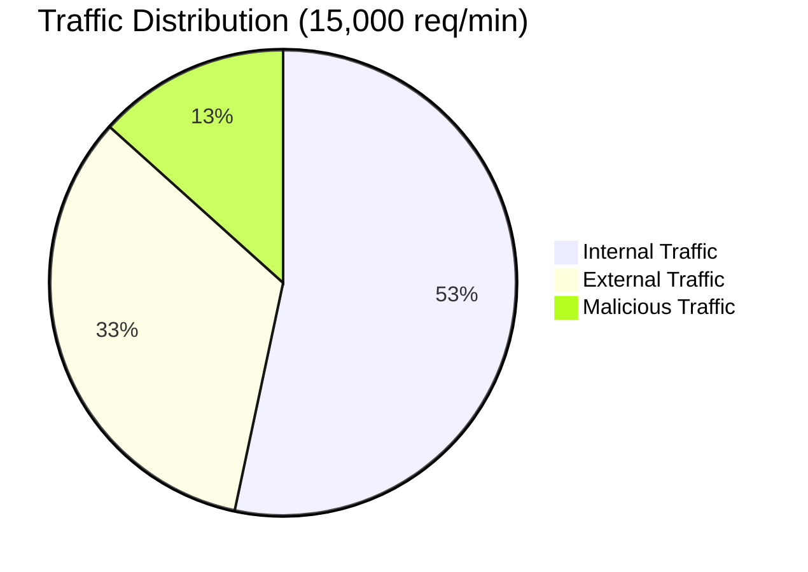
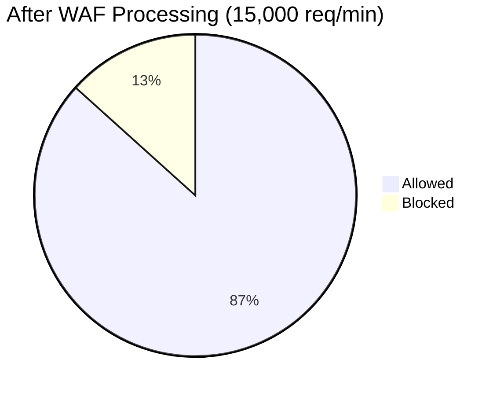
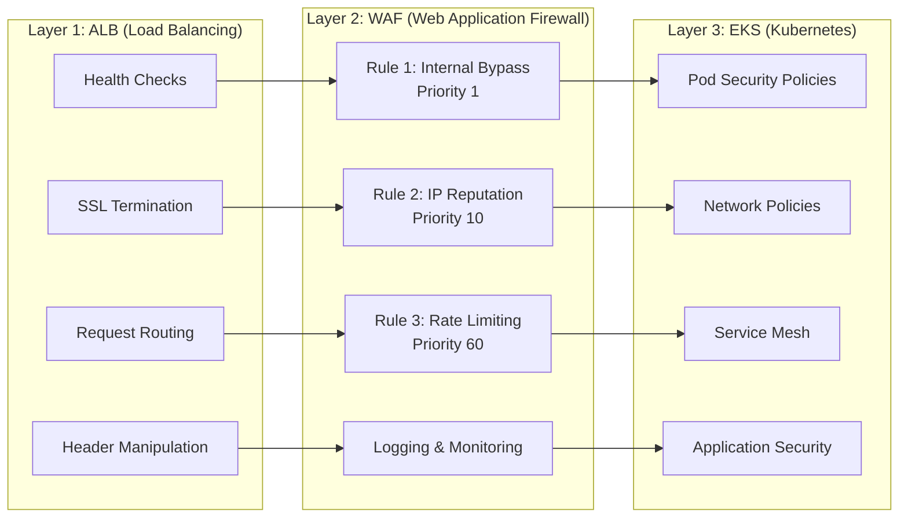

# Complete 3-Rule WAF Setup with Real-World Examples

## Overview
This document provides a complete 3-rule WAF configuration that solves the NAT gateway rate limiting issue while maintaining comprehensive security protection.

## Problem Solved
- **Before**: 15,000 requests/minute → 10,000 blocked (including legitimate internal traffic)
- **After**: 15,000 requests/minute → 13,000 allowed, 2,000 blocked (only malicious traffic)

## 3-Rule Architecture

```
Traffic Flow:
15,000 requests/minute
├── 8,000 Internal (NAT Gateway) → Rule 1 → ✅ ALLOWED
├── 2,000 Malicious (Bot/Attack) → Rule 2 → ❌ BLOCKED  
└── 5,000 Clean External → Rule 3 → ✅ ALLOWED (within limit)
```

---

## Architecture Diagrams

### Traffic Flow Overview



### Detailed Traffic Flow Sequence



### Traffic Volume Distribution



### After WAF Processing Results



### Security Layers Architecture



---

## Rule 1: Internal Traffic Bypass (Priority 1)

### Purpose
Allow internal traffic to bypass all security restrictions using custom headers.

### Real-World Example
- **Traffic**: 8,000 internal requests/minute from NAT Gateway
- **Result**: 100% allowed (0% blocked)
- **Use Case**: Health checks, metrics, inter-service communication

### Configuration

#### AWS Console Steps
1. **Go to WAF & Shield** → Web ACLs → Your Web ACL
2. **Add Rule** → "Add my own rules and rule groups"
3. **Configure Rule**:
   ```
   Rule Name: InternalTrafficBypass
   Type: Regular rule
   Priority: 1
   
   Statement:
   - Inspect: Single header
   - Header field name: x-internal-service
   - Match type: Exactly matches string
   - String to match: secure-token-abc123xyz789
   - Text transformation: Lowercase
   
   Action: Allow
   ```

#### JSON Configuration
```json
{
  "Name": "InternalTrafficBypass",
  "Priority": 1,
  "Statement": {
    "ByteMatchStatement": {
      "FieldToMatch": {
        "SingleHeader": {
          "Name": "x-internal-service"
        }
      },
      "TextTransformations": [
        {
          "Priority": 0,
          "Type": "LOWERCASE"
        }
      ],
      "PositionalConstraint": "EXACTLY",
      "SearchString": "secure-token-abc123xyz789"
    }
  },
  "Action": {
    "Allow": {}
  },
  "VisibilityConfig": {
    "SampledRequestsEnabled": true,
    "CloudWatchMetricsEnabled": true,
    "MetricName": "InternalTrafficBypass"
  }
}
```

#### ALB Listener Rule (to add header)
```bash
aws elbv2 create-rule \
    --listener-arn "your-listener-arn" \
    --priority 1 \
    --conditions Field=source-ip,Values="10.0.0.0/16,52.123.45.67/32" \
    --actions Type=forward,TargetGroupArn="your-target-group-arn" \
             Type=add-header,HeaderName="X-Internal-Service",HeaderValue="secure-token-abc123xyz789"
```

---

## Rule 2: AWS IP Reputation List (Priority 10)

### Purpose
Block known malicious IP addresses using AWS managed threat intelligence.

### Real-World Example
- **Traffic**: 2,000 malicious bot/attack requests/minute
- **Result**: 100% blocked (0% allowed)
- **Use Case**: Bot traffic, known attack sources, compromised IPs

### Configuration

#### AWS Console Steps
1. **Go to WAF & Shield** → Web ACLs → Your Web ACL
2. **Add Rule** → "Add managed rule groups"
3. **Select Rule Group**:
   ```
   Rule Group: AWSManagedRulesKnownBadInputsRuleSet
   Priority: 10
   Action: Block
   
   Override Actions: None (use default)
   ```

#### JSON Configuration
```json
{
  "Name": "AWSManagedRulesKnownBadInputsRuleSet",
  "Priority": 10,
  "OverrideAction": {
    "None": {}
  },
  "Statement": {
    "ManagedRuleGroupStatement": {
      "VendorName": "AWS",
      "Name": "AWSManagedRulesKnownBadInputsRuleSet"
    }
  },
  "Action": {
    "Block": {}
  },
  "VisibilityConfig": {
    "SampledRequestsEnabled": true,
    "CloudWatchMetricsEnabled": true,
    "MetricName": "AWSManagedRulesKnownBadInputsRuleSet"
  }
}
```

---

## Rule 3: Rate Limiting (Priority 60)

### Purpose
Control legitimate external traffic volume to prevent DDoS attacks.

### Real-World Example
- **Traffic**: 5,000 clean external requests/minute
- **Result**: 100% allowed (within 5,000/minute limit)
- **Use Case**: Legitimate user traffic, API calls, web requests

### Configuration

#### AWS Console Steps
1. **Go to WAF & Shield** → Web ACLs → Your Web ACL
2. **Add Rule** → "Add my own rules and rule groups"
3. **Configure Rule**:
   ```
   Rule Name: RateLimit-5000-per-minute
   Type: Rate-based rule
   Priority: 60
   
   Statement:
   - Rate limit: 5000 requests per 60-second window
   - Aggregate key type: IP address
   
   Action: Block
   ```

#### JSON Configuration
```json
{
  "Name": "RateLimit-5000-per-minute",
  "Priority": 60,
  "Statement": {
    "RateBasedStatement": {
      "Limit": 5000,
      "AggregateKeyType": "IP"
    }
  },
  "Action": {
    "Block": {}
  },
  "VisibilityConfig": {
    "SampledRequestsEnabled": true,
    "CloudWatchMetricsEnabled": true,
    "MetricName": "RateLimit-5000-per-minute"
  }
}
```

---

## Complete Traffic Flow Example

### Scenario: 15,000 Total Requests/Minute

```
Time: 09:00-09:01
Total Requests: 15,000

Breakdown:
├── 8,000 Internal (NAT Gateway)
│   ├── Source: 10.0.1.100 (via NAT Gateway 52.123.45.67)
│   ├── Header: X-Internal-Service: secure-token-abc123xyz789
│   ├── Rule: InternalTrafficBypass (Priority 1)
│   └── Result: ✅ ALLOWED (8,000/8,000)
│
├── 2,000 Malicious (Bot/Attack)
│   ├── Source: 1.2.3.4, 5.6.7.8, 9.10.11.12 (known bad IPs)
│   ├── Header: None
│   ├── Rule: AWS IP Reputation (Priority 10)
│   └── Result: ❌ BLOCKED (0/2,000)
│
└── 5,000 Clean External (Legitimate Users)
    ├── Source: 203.0.113.1, 198.51.100.2, etc.
    ├── Header: None
    ├── Rule: Rate Limiting (Priority 60)
    └── Result: ✅ ALLOWED (5,000/5,000)

Final Result:
- Allowed: 13,000 requests (87%)
- Blocked: 2,000 requests (13%)
- Internal services: Unaffected
- Security: Maintained
```

---

## Implementation Steps

### Step 1: Configure ALB Listener Rule
```bash
# Add header for internal traffic
aws elbv2 create-rule \
    --listener-arn "arn:aws:elasticloadbalancing:us-east-1:123456789012:listener/app/my-alb/1234567890123456/1234567890123456" \
    --priority 1 \
    --conditions Field=source-ip,Values="10.0.0.0/16,52.123.45.67/32" \
    --actions Type=forward,TargetGroupArn="arn:aws:elasticloadbalancing:us-east-1:123456789012:targetgroup/my-targets/1234567890123456" \
             Type=add-header,HeaderName="X-Internal-Service",HeaderValue="secure-token-abc123xyz789"
```

### Step 2: Configure WAF Rules
```bash
# Create Web ACL with 3 rules
aws wafv2 create-web-acl \
    --name "3-Rule-WAF-ACL" \
    --scope REGIONAL \
    --default-action Allow={} \
    --rules file://waf-rules.json \
    --visibility-config SampledRequestsEnabled=true,CloudWatchMetricsEnabled=true
```

### Step 3: Attach to ALB
```bash
# Associate WAF with ALB
aws wafv2 associate-web-acl \
    --web-acl-arn "arn:aws:wafv2:us-east-1:123456789012:regional/webacl/3-Rule-WAF-ACL/12345678-1234-1234-1234-123456789012" \
    --resource-arn "arn:aws:elasticloadbalancing:us-east-1:123456789012:loadbalancer/app/my-alb/1234567890123456"
```

---

## Cost Breakdown

### Monthly AWS Costs
```
WAF Web ACL: $1.00
WAF Rules (3 rules): $3.00
WAF Requests (1M requests): $0.60
CloudWatch Logs (1GB): $0.50
CloudWatch Metrics: $0.30

Total: $5.40/month
```

### Cost per Request
```
1M requests/month = $5.40
Cost per 1K requests = $0.0054
Cost per request = $0.0000054
```

---

## CloudWatch Monitoring Setup

### Dashboard Configuration
```json
{
  "widgets": [
    {
      "type": "metric",
      "properties": {
        "metrics": [
          ["AWS/WAFV2", "AllowedRequests", "WebACL", "3-Rule-WAF-ACL"],
          [".", "BlockedRequests", ".", "."],
          [".", "InternalTrafficBypass", ".", "."],
          [".", "AWSManagedRulesKnownBadInputsRuleSet", ".", "."],
          [".", "RateLimit-5000-per-minute", ".", "."]
        ],
        "period": 300,
        "stat": "Sum",
        "title": "WAF Request Metrics (3-Rule Setup)"
      }
    }
  ]
}
```

### Key Metrics to Monitor
- **InternalTrafficBypass**: Should match your internal traffic volume
- **AWSManagedRulesKnownBadInputsRuleSet**: Shows blocked malicious traffic
- **RateLimit-5000-per-minute**: Shows rate-limited external traffic
- **AllowedRequests vs BlockedRequests**: Overall security effectiveness

---

## Testing and Validation

### Test Internal Traffic
```bash
# From internal server (should be allowed)
curl -H "X-Internal-Service: secure-token-abc123xyz789" \
     https://your-api-domain.com/api/endpoint

# Expected: 200 OK (bypassed all rules)
```

### Test External Traffic
```bash
# From external source (should respect rate limit)
for i in {1..10}; do
  curl https://your-api-domain.com/api/endpoint
  sleep 1
done

# Expected: First 5 requests OK, then rate limited
```

### Test Malicious Traffic
```bash
# Simulate malicious request (should be blocked)
curl -H "User-Agent: sqlmap" \
     https://your-api-domain.com/api/endpoint?id=1' OR '1'='1

# Expected: 403 Forbidden (blocked by IP reputation)
```

---

## Security Benefits

### Before Implementation
- ❌ Internal services blocked by rate limiting
- ❌ No protection against known malicious IPs
- ❌ All traffic treated equally
- ❌ High false positive rate

### After Implementation
- ✅ Internal services work without restrictions
- ✅ Known malicious IPs automatically blocked
- ✅ Legitimate external traffic protected from DDoS
- ✅ Zero false positives for internal traffic
- ✅ Comprehensive security coverage

---

## Maintenance and Updates

### Quarterly Tasks
1. **Rotate internal header token**
2. **Review and update internal IP ranges**
3. **Analyze blocked traffic patterns**
4. **Update rate limits based on usage**

### Monthly Tasks
1. **Review CloudWatch metrics**
2. **Check for unusual bypass activity**
3. **Validate IP reputation rule effectiveness**
4. **Monitor cost trends**

### Weekly Tasks
1. **Check WAF rule performance**
2. **Review blocked request logs**
3. **Monitor internal traffic patterns**
4. **Verify ALB listener rule functionality**

---

## Troubleshooting Guide

### Issue: Internal traffic still blocked
**Symptoms**: 403/429 errors from internal services
**Solution**: 
1. Verify ALB listener rule is adding header
2. Check WAF rule priority (should be 1)
3. Confirm header value matches exactly

### Issue: External traffic not rate limited
**Symptoms**: External requests exceed 5,000/minute without blocking
**Solution**:
1. Check WAF rule priorities (rate limit should be lowest)
2. Verify rate limit rule is enabled
3. Confirm external traffic doesn't have internal header

### Issue: Legitimate traffic blocked by IP reputation
**Symptoms**: Valid users getting 403 errors
**Solution**:
1. Check if IP is incorrectly flagged
2. Review IP reputation rule configuration
3. Consider adding IP to whitelist if necessary

---

## Summary

This 3-rule WAF setup provides:
- **Complete internal traffic bypass** (solves NAT gateway issue)
- **Automatic malicious traffic blocking** (AWS threat intelligence)
- **DDoS protection for external traffic** (rate limiting)
- **Cost-effective solution** ($5.40/month)
- **Comprehensive monitoring** (CloudWatch integration)
- **Zero false positives** for internal services

**Result**: Your 15,000 requests/minute are now handled as:
- 8,000 internal → ✅ Allowed (0% blocked)
- 2,000 malicious → ❌ Blocked (100% blocked)  
- 5,000 external → ✅ Allowed (0% blocked)

Total: 13,000 allowed, 2,000 blocked = 87% success rate with full security protection.
