# Network Architecture Diagram

This diagram illustrates how internal users access applications hosted within multiple AKS clusters (dev2, dev3, q1, and production).

## Architecture Overview

```mermaid
graph TB
    subgraph "INTERNAL USERS"
        UW[User Workstation]
    end
    
    subgraph "Internal DNS"
        DNS1[DNS Server 1]
        DNS2[DNS Server 2]
    end
    
    subgraph "AKS CLUSTER - DEV2"
        subgraph "INGRESS CONTROLLER - DEV2"
            GRAFANA2[Grafana]
            PROMETHEUS2[Prometheus]
            ARGOCD2[ArgoCD]
        end
    end
    
    subgraph "AKS CLUSTER - DEV3"
        subgraph "INGRESS CONTROLLER - DEV3"
            GRAFANA3[Grafana]
            PROMETHEUS3[Prometheus]
            ARGOCD3[ArgoCD]
        end
    end
    
    subgraph "AKS CLUSTER - Q1"
        subgraph "INGRESS CONTROLLER - Q1"
            GRAFANA4[Grafana]
            PROMETHEUS4[Prometheus]
            ARGOCD4[ArgoCD]
        end
    end
    
    subgraph "AKS CLUSTER - PRODUCTION"
        subgraph "INGRESS CONTROLLER - PROD"
            GRAFANA1[Grafana]
            PROMETHEUS1[Prometheus]
            ARGOCD1[ArgoCD]
        end
    end
    
    %% DNS Resolution Flow
    UW -->|resolve internal domain| DNS1
    UW -->|resolve internal domain| DNS2
    DNS1 -->|return Ingress IP| UW
    DNS2 -->|return Ingress IP| UW
    
    %% Application Access Flow
    UW -->|access via internal domain| GRAFANA2
    UW -->|access via internal domain| PROMETHEUS2
    UW -->|access via internal domain| ARGOCD2
    
    UW -->|access via internal domain| GRAFANA3
    UW -->|access via internal domain| PROMETHEUS3
    UW -->|access via internal domain| ARGOCD3
    
    UW -->|access via internal domain| GRAFANA4
    UW -->|access via internal domain| PROMETHEUS4
    UW -->|access via internal domain| ARGOCD4
    
    UW -->|access via internal domain| GRAFANA1
    UW -->|access via internal domain| PROMETHEUS1
    UW -->|access via internal domain| ARGOCD1
    
    %% Styling
    classDef userBox fill:#f9f9f9,stroke:#8B4513,stroke-width:3px
    classDef dnsBox fill:#e1f5fe,stroke:#0277bd,stroke-width:2px
    classDef clusterBox fill:#f3e5f5,stroke:#7b1fa2,stroke-width:3px
    classDef ingressBox fill:#e8f5e8,stroke:#2e7d32,stroke-width:2px
    classDef appBox fill:#fff3e0,stroke:#f57c00,stroke-width:2px
    
    class UW userBox
    class DNS1,DNS2 dnsBox
    class GRAFANA2,PROMETHEUS2,ARGOCD2,GRAFANA3,PROMETHEUS3,ARGOCD3,GRAFANA4,PROMETHEUS4,ARGOCD4,GRAFANA1,PROMETHEUS1,ARGOCD1 appBox
```

## Components Description

### Internal Users
- **User Workstation**: Internal users accessing applications from their workstations

### Internal DNS
- **DNS Server 1 & 2**: Internal DNS servers that resolve internal domain names to Ingress IP addresses

### AKS Clusters
Each cluster contains the following applications behind an Ingress Controller:

#### DEV2 Cluster
- **Grafana**: Monitoring and visualization dashboard
- **Prometheus**: Metrics collection and monitoring
- **ArgoCD**: GitOps continuous deployment tool

#### DEV3 Cluster
- **Grafana**: Monitoring and visualization dashboard
- **Prometheus**: Metrics collection and monitoring
- **ArgoCD**: GitOps continuous deployment tool

#### Q1 Cluster
- **Grafana**: Monitoring and visualization dashboard
- **Prometheus**: Metrics collection and monitoring
- **ArgoCD**: GitOps continuous deployment tool

#### Production Cluster
- **Grafana**: Monitoring and visualization dashboard
- **Prometheus**: Metrics collection and monitoring
- **ArgoCD**: GitOps continuous deployment tool

## Data Flow

1. **DNS Resolution**: Internal users query the Internal DNS servers to resolve internal domain names
2. **IP Resolution**: DNS servers return the appropriate Ingress IP address for the requested service
3. **Application Access**: Users access applications directly through the Ingress Controller using the resolved internal domain names

## Benefits of Multi-Cluster Architecture

- **Environment Isolation**: Each cluster (dev2, dev3, q1, production) operates independently
- **Scalability**: Applications can be scaled independently across clusters
- **High Availability**: Failure in one cluster doesn't affect others
- **Development Workflow**: Different environments support various stages of development and testing
